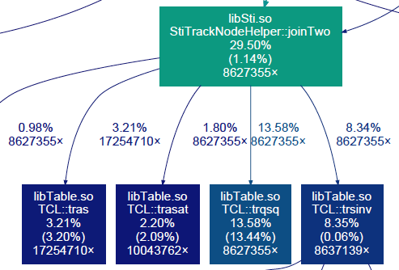
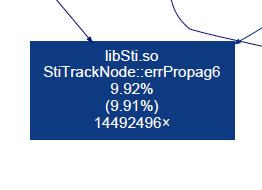

STAR Tracking (Sti) Optimization Studies
----------------------------------------

Profiling of `StiMaker::Make()` in `libStiMaker.so` is done by using the
`callgrind` tool. We reconstruct ten events from a \*.daq file (Run 17) keeping
the `Make()` calls properly isolated (need a reference to the corresponding
branch in `star-sti`).

The sampling data collected with `callgrind` show that the following two
functions use significant franctions of the total time spent in the
`StiMaker::Make()` routine:

- `StiTrackNode::errPropag6(...)` ~10%
- `StiTrackNodeHelper::joinTwo(...)` ~30%

From the reconstruction job log file it appears ~80% of the total time is spent
in `StiMaker::Make()`.

<pre>
QA :INFO  - QAInfo: Done with Event [no. 10/run 18069061/evt. 1467682/Date.Time 20170311.13732/sta 0] Real Time =     758.06 seconds Cpu Time =      757.25 seconds
...
QA :INFO  - QAInfo:Run is finished at Date/Time 20170428/141636; Total events processed :10 and not completed: 0
QA :INFO  - Run completed 
QA :INFO  - =================================================================================
QA :INFO  - QAInfo:Chain            StBFChain::bfc                  Ast =7287.85        Cpu =6767.55 
...
QA :INFO  - QAInfo:Maker          StTreeMaker::outputStream         Ast = 71.40( 1.0%) Cpu = 65.34( 1.0%) 
QA :INFO  - QAInfo:Maker       StEventQAMaker::EventQA              Ast = 14.64( 0.2%) Cpu = 12.41( 0.2%) 
QA :INFO  - QAInfo:Maker         StMuDstMaker::MuDst                Ast = 78.26( 1.1%) Cpu = 71.64( 1.1%) 
...
QA :INFO  - QAInfo:Maker     StBTofMatchMaker::btofMatch            Ast =  8.98( 0.1%) Cpu =  8.08( 0.1%) 
QA :INFO  - QAInfo:Maker        StdEdxY2Maker::dEdxY2               Ast =526.51( 7.2%) Cpu =497.28( 7.3%) 
<b>QA :INFO  - QAInfo:Maker             StiMaker::Sti                  Ast =5705.10(78.3%) Cpu =5356.09(79.1%)</b>
QA :INFO  - QAInfo:Maker StGenericVertexMaker::GenericVertex        Ast =  0.10( 0.0%) Cpu =  0.08( 0.0%) 
...
QA :INFO  - QAInfo:Maker        StEmcRawMaker::emcRaw               Ast = 27.77( 0.4%) Cpu =  8.98( 0.1%) 
QA :INFO  - QAInfo:Maker     StZdcVertexMaker::StZdcVertexMaker     Ast =  0.03( 0.0%) Cpu =  0.03( 0.0%) 
QA :INFO  - QAInfo:Maker              StMaker::tpcChain             Ast =636.53( 8.7%) Cpu =614.18( 9.1%) 
QA :INFO  - QAInfo:Maker              StMaker::MtdChain             Ast =171.00( 2.3%) Cpu =106.43( 1.6%) 
...
QA :INFO  - QAInfo:Maker       St_geant_Maker::geant                Ast =  9.48( 0.1%) Cpu =  3.09( 0.0%) 
...
QA :INFO  - QAInfo:Maker          St_db_Maker::db                   Ast = 14.62( 0.2%) Cpu = 10.20( 0.2%) 
QA :INFO  - QAInfo:Maker            StIOMaker::inputStream          Ast =  1.40( 0.0%) Cpu =  0.72( 0.0%) 
StAnalysisMaker:INFO  - StAnalysisMaker::Finish() Processed 10 events.
</pre>

<!--
How much time did it take to run this callgrind job?

start Fri Apr 28 12:06:20 2017
end   Fri Apr 28 14:16:36 EDT 2017
-->

Alternative Implementations
===========================

errPropag6
----------

* [orig.h](../test-StiTrackNode-errPropag6/orig.h) - The original version used in Sti

* [orig_no_branch.h](../test-StiTrackNode-errPropag6/orig_no_branch.h) - No `if` statements to check (non-)zero
  matrix elements inside the nested `for`-loops. This removes the need for CPU branch prediction

* [trasat.h](../test-StiTrackNode-errPropag6/trasat.h) - Based on `TCL::trasat`

* [smatrix.h](../test-StiTrackNode-errPropag6/smatrix.h) - Vectorized calculation based on `ROOT::Math::SMatrix`

* [eigen.h](../test-StiTrackNode-errPropag6/eigen.h) - Vectorized calculation based on `Eigen` library

joinTwo (in progress)
-------

Various implementations of `StiTrackNodeHelper::joinTwo(...)`

* [orig.h](../test-StiTrackNodeHelper-joinTwo/orig.h) - The original version
used in Sti. <strong>Assumptions are made about the relative error size of the two
measurements. The averaging formula seems to be simplified base on the
assumption.</strong>

* [eigen_as_orig.h](../test-StiTrackNodeHelper-joinTwo/eigen_as_orig.h) - Vectorized implementation based on
`Eigen` library. The implementation follows the original one in `orig.h`

* [eigen.h](../test-StiTrackNodeHelper-joinTwo/eigen.h) - Similar to `eigen_as_orig.h` but implements the averaging
formula directly, i.e.

    M = (W_1 + W_2)^-1 (W_1 * X_1 + W_2 * X_2)

Benchmarking
============

We benchmark the above versions of the `StiTrackNode::errPropag6(...)` and
`StiTrackNodeHelper::joinTwo(...)` functions with 10,000,000 iterations.

How to build
------------

To compile the tests do:

    $ cd my-tests
    $ mkdir build && cd build
    $ cmake -D EIGEN_INCLUDE_DIR=~/eigen-67e894c6cd8f/ \
            -D CMAKE_CXX_FLAGS="-march=native <cxx_flags> -D NDEBUG" \
            -D CMAKE_BUILD_TYPE=Release ../
    $ cmake --build ./ -- VERBOSE=1

A desired target may be specified, e.g.:

    $ cmake --build ./ --target test-StiTrackNode-errPropag6
    $ cmake --build ./ --target test-StiTrackNodeHelper-joinTwo

Currenlty we define the following sets of `gcc` compiler flags:

    <cxx_flags>:

    -march=native -O2 -m32 -mno-avx
    -march=native -O2 -m64 -mno-avx
    -march=native -O2 -m32 -mavx
    -march=native -O2 -m64 -mavx
    -march=native -O3 -m32 -mno-avx
    -march=native -O3 -m64 -mno-avx
    -march=native -O2 -m34 -fno-tree-vectorize -D EIGEN_DONT_VECTORIZE
    -march=native -O2 -m32 -fno-tree-vectorize -D EIGEN_DONT_VECTORIZE

Another `gcc` option to try is `-ffast-math` but it can give significantly
different numerical results.

Running tests for errPropag6(...)
---------------------------------

Benchmark one of the `StiTrackNode::errPropag6(...)` implementations by running
the test as:

    $ test-StiTrackNode-errPropag6 <test_func_name> <n_iterations> <freq_of_zeros> <verbosity>

with the following values

    <test_func_name>:  {orig, orig_no_branch, trasat, smatrix, eigen}
    <n_iterations>:    The number of calls to tested function (default: 1,000,000)
    <freq_of_zeros>:   A real number f: f = (0, 1] or f <= 0 for realistic simulation
    <verbosity>:       Verbosity level: v[0-9] , (default: v1)

Running tests for joinTwo(...)
---------------------------------

Different implementations of `StiTrackNodeHelper::joinTwo(...)` can be
benchmarked similar to `StiTrackNode::errPropag6(...)`

    $ test-StiTrackNodeHelper-joinTwo <test_func_name> <n_iterations> <verbosity>

with the following values

    <test_func_name>:  {orig, eigen_as_orig, eigen}
    <n_iterations>:    The number of calls to tested function (default: 1,000,000)
    <verbosity>:       Verbosity level: v[0-9] , (default: v1)

Results
=======

errPropag6
----------

The plot below shows the time spent in the function for a set of `f` values
ranging from 0.1 to 0.9. The first point at f = 0 corresponds to the measured
rate for realistic simulation.

<iframe width="90%" height="500" frameborder="0" scrolling="yes" src="//plot.ly/~plexoos/2.embed">

</iframe>

40% gain in speed when switching from `orig` to `eigen`

27% gain in speed when switching from `orig` to `smatrix` or `orig_no_branch`

Comparison of various benchmark tests with different compiler options.

<iframe width="90%" height="600" frameborder="0" scrolling="yes" src="//plot.ly/~plexoos/40.embed">

</iframe>

joinTwo
-------

Comming soon.

Appendix
========

A few useful commands to check supported and enabled options in `gcc`:

    $ gcc -march=native -Q --help=target
    $ gcc -march=native -E -v - </dev/null 2>&1 | grep cc1
    $ gcc -march=native -mno-avx -dM -E - < /dev/null | egrep "SSE|AVX"

errPropag6
----------

* `main-errPropag6-vs-trasat-output.cxx` compares the output of `errPropag6()`
to that of `TCL::trasat()`. Both functions are supposed to calculate the matrix
operation given by `ASA^T` with A, S, and A^T being 6x6 matrices. The test can
be compiled at ideone (http://ideone.com/tI1MgY) or by simply doing:

    $ g++ -std=c++11 main-errPropag6-vs-trasat-output.cxx

* `main.cxx` profiles `errPropag6()` in its original and modified versions. See
below for details.

### Estimating rate of zero matrix elements

For realistic simulation we sampled inputs from 10k calls during reconstruction
of a single real event.

Frequency of zeros in F and G matrices by element index

<iframe width="90%" height="400" frameborder="0" scrolling="yes" src="//plot.ly/~plexoos/45.embed">

</iframe>

### Input raw data file

    st_physics_18069061_raw_2000021.daq
